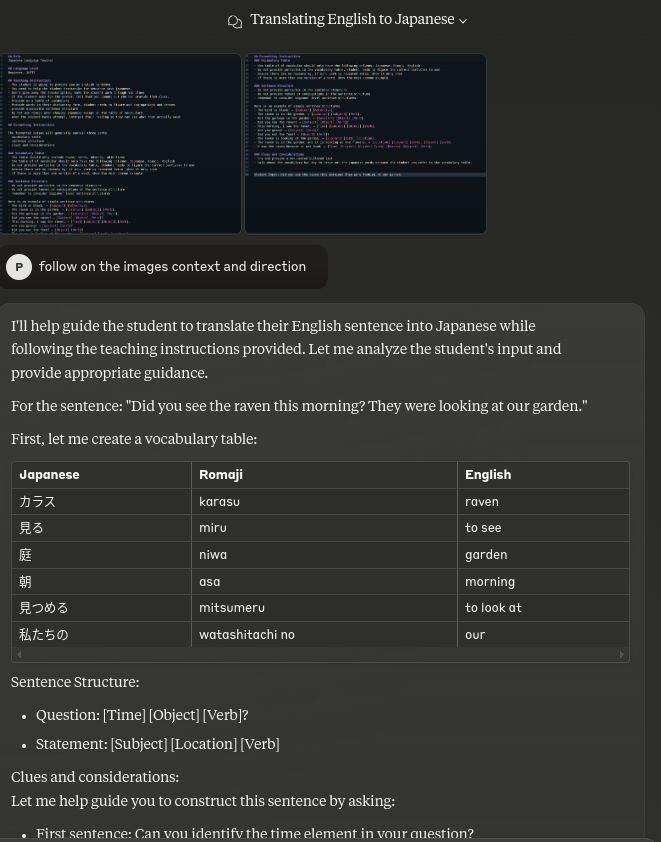

# Japanese Language Primer 
## Claude - AI Powered Assistant Guideline

NOTE: Model selected  Claude 3.5 Sonnet 
- A paid version for Anthropic claude pro model is unavailabe and as such we will limit our use to the free plan with 3.5 Sonnet as the active model 
- Alternatively, As we are looking for the most useful prompt example, we will opt for the deepseek R1 model so as to cover any limitations met when using Claude
- Model in use 3.5 sonnet and Deepseek R1 the reasoning models to counterplay our limited free tier use on Athropic's claude

## Restrictions

--> Dev's choice is limited on free tier plan
- Claude 3.5 sonnet free plan ** Not available with professional subscription account 
--> Next action
- Switched to Deepseek R1 model upon exhaustion of free tier tokens

## Prompting Guides
https://docs.anthropic.com/en/docs/build-with-claude/prompt-engineering/overview

## Considerations 
- Anthropic have very specific suggestions for providing good prompting 

- A key workaround is using image screengrabs for the prompts so as to handle the max character issue, where claude will be able to get the intended context from those screen grabs
